# 東方永夜抄　～ Imperishable Night

<picture>
  <source media="(prefers-color-scheme: dark)" srcset="resources/progress_dark.svg">
  
</picture>

[![Discord][discord-badge]][discord] <- click here to join discord server.

[discord]: https://discord.gg/VyGwAjrh9a
[discord-badge]: https://img.shields.io/discord/1147558514840064030?color=%237289DA&logo=discord&logoColor=%23FFFFFF

This project aims to perfectly reconstruct the source code of [Touhou Eiyashou ~ Imperishable Night 1.00d](https://en.touhouwiki.net/wiki/Imperishable_Night) by Team Shanghai Alice.

**This project is still highly work in progress and in its early stages.**


## Installation

### Executable

This project requires the original `th08.exe` version 1.00d (SHA256 hashsum 330fbdbf58a710829d65277b4f312cfbb38d5448b3df523e79350b879213d924, you can check hashsum on windows with command `certutil -hashfile <path-to-your-file> SHA256`.)

Copy `th08.exe` to `resources/game.exe`.

### Dependencies

The build system has the following package requirements:

- `python3` >= 3.4
- `msiextract` (On linux/macos only)
- `wine` (on linux/macos only, prefer CrossOver on macOS to avoid possible CL.EXE heap issues)
- `aria2c` (optional, allows for torrent downloads, will automatically install on Windows if selected.)

The rest of the build system is constructed out of Visual Studio 2002 and DirectX 8.0 from the Web Archive.

#### Configure devenv

This will download and install compiler, libraries, and other tools.

If you are on windows, and for some reason want to download dependencies manually,
run this command to get the list of files to download:

```
python scripts/create_devenv.py scripts/dls scripts/prefix --no-download
```

But if you want everything to be downloaded automatically, run it like this instead:

```
python scripts/create_devenv.py scripts/dls scripts/prefix
```

And if you want to use torrent to download those dependencies, use this:

```
python scripts/create_devenv.py scripts/dls scripts/prefix --torrent
```

On linux and mac, run the following script:
```bash
# NOTE: On macOS if you use CrossOver.
# export WINE=<CrossOverPath>/wine
./scripts/create_th08_prefix
```

#### Building

Run the following script:

```
python3 ./scripts/build.py
```

This will automatically generate a ninja build script `build.ninja`, and run
ninja on it.

# Credits

We would like to extend our thanks to the following individuals for their
invaluable contributions:

- @EstexNT for porting the [`var_order` pragma](scripts/pragma_var_order.cpp) to
  MSVC7.